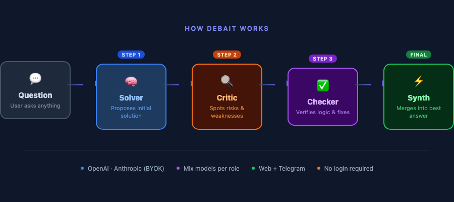

# 🤖 Debait — Multi-AI Debate Engine

> **Multiple AIs argue. One best answer wins.**

Instead of asking one AI, Debait runs a structured debate: a **Solver** proposes, a **Critic** attacks, a **Checker** verifies, and a **Synth** delivers the final refined answer — all in your browser, no login required.

[](https://python.org)
[](https://fastapi.tiangolo.com)
[](LICENSE)
[](https://github.com/junsungkim-lab/debait)

**🌐 Language:** English | [한국어](README.ko.md) | [中文](README.zh.md)

---



---

## ⚡ Quickstart (Python only, no Docker needed)

```bash
git clone https://github.com/junsungkim-lab/debait.git
cd debait
pip install -r requirements.txt
cp .env.example .env          # fill in your keys (see below)
uvicorn app.main:app --port 8000
```

Open `http://localhost:8000` → Settings → Add your API key → Ask anything.

> Data (conversations, API keys) is saved to `app.db` locally and persists across restarts.

---

## 🎯 Why Debait?

Most AI tools give you **one model's answer**. Debait gives you a **peer-reviewed answer**.

| | Single ChatGPT | AutoGen / CrewAI | **Debait** |
|--|--|--|--|
| Setup | Instant | Complex config | **3 commands** |
| Debate roles | ❌ | Custom agents | **Built-in (Solver/Critic/Checker/Synth)** |
| Web UI | ❌ | ❌ | **✅ Included** |
| Telegram | ❌ | ❌ | **✅ Built-in** |
| BYOK | ❌ | ❌ | **✅ 5 Providers** |
| Mix models per role | ❌ | Partial | **✅ Any role = any model** |

---

## 💡 Use Cases

- **Engineering decisions** — "Should we use microservices or monolith for this stage?"
- **Code review** — Paste code, get Solver + Critic + Checker perspective
- **Research synthesis** — Compare arguments on any topic
- **Writing** — Draft → critique → final polished version
- **Risk analysis** — Any plan gets automatically stress-tested by Critic

---

## 🔧 Supported AI Providers

| Provider | Get Key | Cheap Model | Quality Model |
|----------|---------|-------------|---------------|
| **OpenAI** | [platform.openai.com](https://platform.openai.com/api-keys) | `openai:gpt-4o-mini` | `openai:gpt-4o` |
| **Anthropic** | [console.anthropic.com](https://console.anthropic.com/settings/keys) | `anthropic:claude-haiku-4-5-20251001` | `anthropic:claude-sonnet-4-6` |
| **Google Gemini** | [aistudio.google.com](https://aistudio.google.com/apikey) | `google:gemini-2.0-flash` | `google:gemini-2.5-pro-preview-05-06` |
| **Groq** | [console.groq.com](https://console.groq.com/keys) | `groq:llama-3.1-8b-instant` | `groq:llama-3.3-70b-versatile` |
| **Mistral** | [console.mistral.ai](https://console.mistral.ai/api-keys) | `mistral:mistral-small-latest` | `mistral:mistral-medium-latest` |

Each **role can use a different provider** — mix and match for cost vs quality.

---

## 🏗️ How It Works

```
Your Question
     │
     ▼
┌─────────┐    ┌─────────┐    ┌─────────┐    ┌─────────┐
│  Solver │───▶│  Critic │───▶│ Checker │───▶│  Synth  │
│         │    │         │    │         │    │         │
│Proposes │    │ Attacks │    │Verifies │    │ Final   │
│solution │    │ & risks │    │& fixes  │    │ answer  │
└─────────┘    └─────────┘    └─────────┘    └─────────┘
     │               │               │               │
  any LLM         any LLM         any LLM         any LLM
```

Each role can use a **different model** (e.g., Solver=GPT-4o, Critic=Claude Sonnet, Synth=Claude Haiku).
Simple questions skip directly to Solver → Synth for speed and cost efficiency.

---

## 🚀 Full Setup

### 1. Environment Variables

```bash
cp .env.example .env
```

| Variable | Required | Description |
|----------|----------|-------------|
| `MASTER_KEY` | ✅ | Fernet key to encrypt stored API keys |
| `WEBHOOK_SECRET` | ✅ | Secret path for Telegram webhook |
| `TELEGRAM_BOT_TOKEN` | ✅ | From [@BotFather](https://t.me/BotFather) |
| `BASE_URL` | ✅ | Your app's public URL (e.g. `http://localhost:8000`) |

Generate keys:
```bash
# MASTER_KEY
python -c "from cryptography.fernet import Fernet; print(Fernet.generate_key().decode())"

# WEBHOOK_SECRET
python -c "import secrets; print(secrets.token_urlsafe(48))"
```

### 2. Add Your API Key

Go to `http://localhost:8000/settings` → paste your OpenAI or Anthropic key.
Keys are **encrypted at rest** using your `MASTER_KEY` — never stored in plaintext.

### 3. Configure Models (Optional)

Mix and match any model per role in Settings:

```
Solver  → anthropic:claude-sonnet-4-6   # quality answer
Critic  → openai:gpt-4o-mini            # cheap critique
Checker → openai:gpt-4o-mini            # cheap verify
Synth   → anthropic:claude-sonnet-4-6   # quality final
```

---

## 🐳 Docker

```bash
docker compose up --build
```

## ☸️ Kubernetes

```bash
cp application.yaml.example application.yaml
# Fill in your secrets, then:
docker build -t debait:latest .
kubectl apply -f application.yaml
# Open http://localhost:30090
```

---

## 📁 Project Structure

```
debait/
├── app/
│   ├── main.py                  # FastAPI routes
│   ├── orchestrator/
│   │   ├── runner.py            # Debate engine (Solver→Critic→Checker→Synth)
│   │   ├── prompts.py           # Role-specific system prompts
│   │   └── router.py            # SIMPLE vs MULTI routing
│   ├── providers/
│   │   ├── openai_provider.py
│   │   └── anthropic_provider.py
│   └── templates/               # Server-side HTML UI
├── scripts/
│   ├── set_webhook.py           # Register Telegram webhook
│   └── delete_webhook.py
├── Dockerfile
├── docker-compose.yml
└── application.yaml.example     # Kubernetes template
```

---

## 🔒 Security & Privacy

- API keys are **encrypted with Fernet (AES-128-CBC)** before storage
- Keys never leave your server
- No analytics, no telemetry
- SQLite database stays **local** — your conversations are yours
- `MASTER_KEY` loss = encrypted keys unrecoverable (by design)

---

## 🗺️ Roadmap

- [ ] Streaming responses (real-time debate display)
- [ ] Custom role prompts via UI
- [ ] Export conversation as Markdown/PDF
- [ ] Multi-round debate (iterative refinement)
- [ ] RAG support (attach documents to questions)
- [ ] REST API for programmatic access

---

## 🤝 Contributing

PRs welcome. For major changes, open an issue first.

```bash
git checkout -b feature/your-feature
# make changes
git push origin feature/your-feature
# open PR
```

---

## 📄 License

MIT — use it, fork it, build on it.

---

*If Debait saved you from a bad decision, consider leaving a ⭐ — it helps others find this project.*
